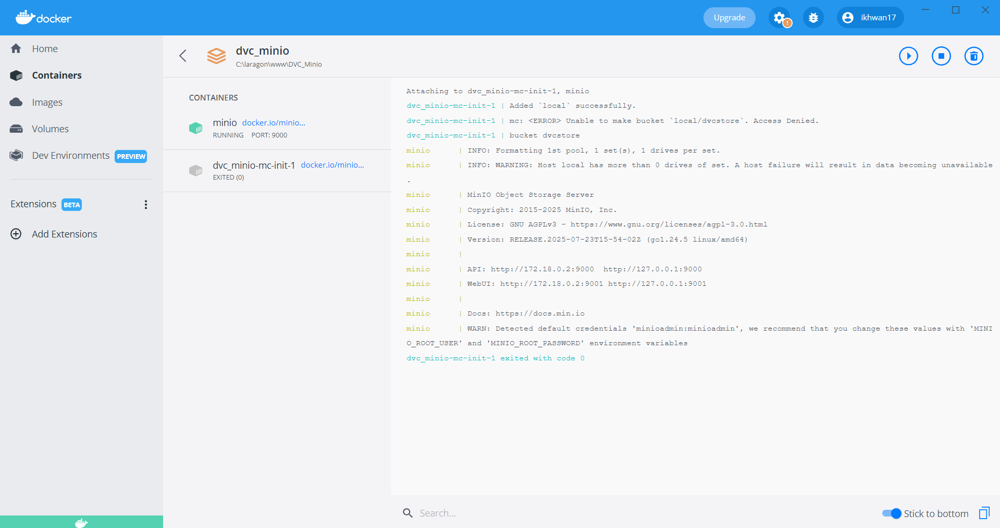

# DVC + MinIO + GitLab CI/CD + GitHub Actions

Template ringkas untuk versi data dan model menggunakan **DVC**, penyimpanan artefak di **MinIO** (S3-compatible), serta otomatisasi pipeline dengan **GitLab CI/CD** dan **GitHub Actions**.

## Isi
- [Arsitektur Singkat](#arsitektur-singkat)
- [Prasyarat](#prasyarat)
- [Menjalankan MinIO (Docker Compose)](#menjalankan-minio-docker-compose)
- [Menyiapkan Proyek DVC](#menyiapkan-proyek-dvc)
  - [Opsi A: DVC via Docker (tanpa install)](#opsi-a-dvc-via-docker-tanpa-install)
  - [Opsi B: Install DVC native](#opsi-b-install-dvc-native)
- [Konfigurasi Remote DVC → MinIO](#konfigurasi-remote-dvc--minio)
  - [Windows/macOS (Docker Desktop)](#windowsmacos-docker-desktop)
  - [Linux host / WSL (DVC native)](#linux-host--wsl-dvc-native)
- [Contoh Pipeline Sederhana](#contoh-pipeline-sederhana)
- [GitLab CI/CD](#gitlab-cicd)
  - [Variabel CI/CD](#variabel-cicd)
  - [Contoh `.gitlab-ci.yml`](#contoh-gitlab-ciyml)
- [GitHub Actions](#github-actions)
  - [GitHub Secrets](#github-secrets)
  - [Contoh Workflow `dvc-minio.yml`](#contoh-workflow-dvc-minioyml)
- [Workflow Harian](#workflow-harian)
- [Troubleshooting](#troubleshooting)
- [Catatan Keamanan](#catatan-keamanan)
- [Referensi Resmi](#referensi-resmi)

## Arsitektur Singkat
- Kode dan metadata DVC disimpan di Git (GitLab atau GitHub).
- Objek data/model disimpan di MinIO (bucket `dvcstore`).
- DVC mengelola versi dan pipeline; CI menjalankan `dvc repro` dan `dvc push`.

## Prasyarat
- Docker dan Docker Compose.
- Git dan akses ke GitLab/GitHub.
- Python 3.x (untuk script contoh).

## Menjalankan MinIO (Docker Compose)

`docker-compose.yml`
```yaml
version: "3.9"
services:
  minio:
    image: docker.io/minio/minio:latest
    container_name: minio
    command: server /data --console-address ":9001"
    environment:
      MINIO_ROOT_USER: minioadmin
      MINIO_ROOT_PASSWORD: minioadmin
    ports:
      - "9000:9000"  # S3 API
      - "9001:9001"  # Console GUI
    volumes:
      - minio_data:/data
    healthcheck:
      test: ["CMD", "curl", "-f", "http://localhost:9000/minio/health/live"]
      interval: 10s
      timeout: 5s
      retries: 5

  mc-init:
    image: docker.io/minio/mc:latest
    depends_on:
      minio:
        condition: service_healthy
    entrypoint: >
      /bin/sh -c "
      mc alias set local http://minio:9000 ${MINIO_ROOT_USER} ${MINIO_ROOT_PASSWORD} &&
      mc mb -p local/dvcstore || true &&
      echo 'bucket dvcstore siap'
      "
    environment:
      MINIO_ROOT_USER: minioadmin
      MINIO_ROOT_PASSWORD: minioadmin
    restart: "no"

volumes:
  minio_data:
````

Jalankan: `docker compose up -d`. Console MinIO: `http://localhost:9001`.



## Menyiapkan Proyek DVC

```bash
git init
dvc init
```

### Opsi A: DVC via Docker (tanpa install)

Linux:

```bash
alias dvc='docker run --rm -it --network host -v "$PWD":/work -w /work \
  -e AWS_ACCESS_KEY_ID -e AWS_SECRET_ACCESS_KEY -e DVC_S3_ENDPOINT \
  docker.io/iterativeai/cml:0-dvc2-base1 dvc'
```

Windows/macOS:

```bash
function dvc { docker run --rm -it -v "${PWD}:/work" -w /work `
  -e AWS_ACCESS_KEY_ID -e AWS_SECRET_ACCESS_KEY -e DVC_S3_ENDPOINT `
  docker.io/iterativeai/cml:0-dvc2-base1 dvc $args }
```

Cek: `dvc --version`.

### Opsi B: Install DVC native

Pilih salah satu.

pipx:

```bash
python -m pip install --upgrade pip pipx
pipx ensurepath
pipx install "dvc[s3]"
```

virtualenv:

```bash
python -m venv .venv
source .venv/bin/activate
pip install "dvc[s3]"
```

conda:

```bash
conda install -c conda-forge dvc dvc-s3
```

## Konfigurasi Remote DVC → MinIO

```bash
dvc remote add -d minio s3://dvcstore/project
dvc remote modify minio use_ssl false
```

### Windows/macOS (Docker Desktop)

Jika DVC berjalan di container:

```bash
dvc remote modify --local minio endpointurl http://host.docker.internal:9000
dvc remote modify --local minio access_key_id minioadmin
dvc remote modify --local minio secret_access_key minioadmin
```

Jika DVC native, gunakan `http://localhost:9000`.

### Linux host / WSL (DVC native)

```bash
dvc remote modify --local minio endpointurl http://localhost:9000
dvc remote modify --local minio access_key_id minioadmin
dvc remote modify --local minio secret_access_key minioadmin
```

Jika DVC di container Linux tanpa `--network host`, gunakan IP gateway Docker, misalnya `http://172.17.0.1:9000`.

## Contoh Pipeline Sederhana

Struktur:

```
.
├─ dvc.yaml
├─ src/
│  ├─ prepare.py
│  └─ train.py
├─ metrics/
│  └─ .gitkeep
├─ .gitignore
└─ requirements.txt
```

`dvc.yaml`

```yaml
stages:
  prepare:
    cmd: python src/prepare.py
    deps:
      - src/prepare.py
    outs:
      - data/raw

  train:
    cmd: python src/train.py
    deps:
      - src/train.py
      - data/raw
    outs:
      - models/model.txt
    metrics:
      - metrics/score.json:
          cache: false
```

`src/prepare.py`

```python
import os, csv, random
random.seed(42)
os.makedirs("data/raw", exist_ok=True)
with open("data/raw/data.csv", "w", newline="") as f:
    w = csv.writer(f)
    w.writerow(["x","y"])
    for i in range(100):
        y = 2*i + 1 + random.randint(-3,3)
        w.writerow([i, y])
print("wrote data/raw/data.csv")
```

`src/train.py`

```python
import csv, math, json, os
xs, ys = [], []
with open("data/raw/data.csv") as f:
    r = csv.DictReader(f)
    for row in r:
        xs.append(float(row["x"]))
        ys.append(float(row["y"]))
def pearson(x, y):
    n = len(x)
    mx, my = sum(x)/n, sum(y)/n
    num = sum((xi-mx)*(yi-my) for xi, yi in zip(x,y))
    den = (sum((xi-mx)**2 for xi in x)*sum((yi-my)**2 for yi in y))**0.5
    return num/den if den else 0.0
corr = round(pearson(xs, ys), 4)
os.makedirs("metrics", exist_ok=True)
with open("metrics/score.json","w") as f:
    json.dump({"pearson_corr": corr}, f, indent=2)
os.makedirs("models", exist_ok=True)
with open("models/model.txt","w") as f:
    f.write("y ≈ 2x + 1\n")
print("pearson_corr:", corr)
```

`.gitignore`

```gitignore
__pycache__/
*.pyc
.venv/
venv/
.dvc/cache/
data/
models/
!metrics/
!metrics/score.json
```

`requirements.txt`

```
# kosong, pakai stdlib saja
```

Jalankan lokal:

```bash
git add .
git commit -m "init template"
dvc repro
dvc metrics show
git add dvc.lock metrics/score.json
git commit -m "first run"
dvc push
```

## GitLab CI/CD

### Variabel CI/CD

Settings → CI/CD → Variables:

* `AWS_ACCESS_KEY_ID` = `minioadmin`
* `AWS_SECRET_ACCESS_KEY` = `minioadmin`
* `DVC_S3_ENDPOINT` = `http://minio:9000`

### Contoh `.gitlab-ci.yml`

```yaml
stages: [setup, repro, push]

image: docker.io/iterativeai/cml:0-dvc2-base1

services:
  - name: docker.io/minio/minio:latest
    alias: minio
    command: ["server", "/data", "--console-address", ":9001"]

variables:
  GIT_DEPTH: "0"
  DVC_REMOTE: "minio"

cache:
  key: dvc-cache
  paths:
    - .dvc/cache/
  policy: pull-push

before_script:
  - python --version
  - dvc --version
  - dvc remote add -d "$DVC_REMOTE" s3://dvcstore/project || true
  - dvc remote modify "$DVC_REMOTE" endpointurl "$DVC_S3_ENDPOINT"
  - dvc remote modify "$DVC_REMOTE" use_ssl false

setup:
  stage: setup
  script:
    - pip install --quiet minio
    - python - <<'PY'
from minio import Minio
import os, time
host = os.environ.get("DVC_S3_ENDPOINT","http://minio:9000").replace("http://","").replace("https://","")
client = Minio(host, access_key=os.environ["AWS_ACCESS_KEY_ID"],
               secret_key=os.environ["AWS_SECRET_ACCESS_KEY"], secure=False)
for _ in range(40):
    try:
        client.list_buckets(); break
    except Exception: time.sleep(2)
if not client.bucket_exists("dvcstore"):
    client.make_bucket("dvcstore")
print("Bucket dvcstore OK.")
PY

repro:
  stage: repro
  needs: [setup]
  script:
    - python -m pip install -r requirements.txt
    - dvc repro -v
    - dvc metrics show
  artifacts:
    paths:
      - metrics/score.json
      - models/
      - .dvc/cache/
    expire_in: 1 week

push:
  stage: push
  needs: [repro]
  rules:
    - if: '$CI_COMMIT_BRANCH == "main"'
  script:
    - dvc push -v
```

## GitHub Actions

### GitHub Secrets

Settings → Secrets and variables → Actions → New repository secret:

* `AWS_ACCESS_KEY_ID` = `minioadmin`
* `AWS_SECRET_ACCESS_KEY` = `minioadmin`

Variabel environment di workflow:

* `DVC_S3_ENDPOINT` = `http://localhost:9000` (runner mengakses service MinIO pada localhost).

### Contoh Workflow `dvc-minio.yml`

Letakkan di `.github/workflows/dvc-minio.yml`.

```yaml
name: DVC + MinIO

on:
  push:
    branches: [ main ]
  pull_request:

jobs:
  ci:
    runs-on: ubuntu-latest

    services:
      minio:
        image: minio/minio:latest
        env:
          MINIO_ROOT_USER: minioadmin
          MINIO_ROOT_PASSWORD: minioadmin
        ports:
          - 9000:9000
          - 9001:9001
        options: >-
          --health-cmd "curl -f http://localhost:9000/minio/health/live || exit 1"
          --health-interval 10s --health-timeout 5s --health-retries 5
        command: ["server","/data","--console-address",":9001"]

    env:
      AWS_ACCESS_KEY_ID: ${{ secrets.AWS_ACCESS_KEY_ID }}
      AWS_SECRET_ACCESS_KEY: ${{ secrets.AWS_SECRET_ACCESS_KEY }}
      DVC_S3_ENDPOINT: http://localhost:9000
      DVC_REMOTE: minio

    steps:
      - name: Checkout
        uses: actions/checkout@v4
        with:
          fetch-depth: 0

      - name: Set up Python
        uses: actions/setup-python@v5
        with:
          python-version: "3.11"

      - name: Install DVC and deps
        run: |
          python -m pip install --upgrade pip
          pip install "dvc[s3]" minio

      - name: Configure DVC remote
        run: |
          dvc remote add -d "$DVC_REMOTE" s3://dvcstore/project || true
          dvc remote modify "$DVC_REMOTE" endpointurl "$DVC_S3_ENDPOINT"
          dvc remote modify "$DVC_REMOTE" use_ssl false

      - name: Ensure bucket exists
        run: |
          python - <<'PY'
          from minio import Minio
          import os, time
          host = os.environ["DVC_S3_ENDPOINT"].replace("http://","").replace("https://","")
          client = Minio(host, access_key=os.environ["AWS_ACCESS_KEY_ID"],
                         secret_key=os.environ["AWS_SECRET_ACCESS_KEY"], secure=False)
          for _ in range(40):
              try:
                  client.list_buckets(); break
              except Exception:
                  time.sleep(2)
          if not client.bucket_exists("dvcstore"):
              client.make_bucket("dvcstore")
          print("Bucket dvcstore OK.")
          PY

      - name: Cache DVC .dvc/cache
        uses: actions/cache@v4
        with:
          path: .dvc/cache
          key: dvc-${{ runner.os }}-${{ hashFiles('dvc.lock') }}
          restore-keys: |
            dvc-${{ runner.os }}-

      - name: Reproduce pipeline
        run: |
          python -m pip install -r requirements.txt || true
          dvc repro -v
          dvc metrics show

      - name: Upload metrics artifact
        uses: actions/upload-artifact@v4
        with:
          name: metrics
          path: metrics/score.json

      - name: Push DVC cache (only on main)
        if: github.ref == 'refs/heads/main'
        run: dvc push -v
```

Catatan:

* GitHub Actions service `minio` diekspos ke job via `localhost:9000`.
* Workflow meng-cache `.dvc/cache` berdasarkan fingerprint `dvc.lock`.

## Workflow Harian

Tambahkan data dan push:

```bash
mkdir -p data/raw
echo "hello dvc" > data/raw/hello.txt
dvc add data/raw
git add data/raw.dvc .gitignore
git commit -m "track data v1"
dvc push -v
git push origin main
```

Jalankan pipeline dan simpan metrik:

```bash
dvc repro
dvc metrics show
git add dvc.lock metrics/score.json
git commit -m "update metrics"
dvc push -v
git push origin main
```

Ambil ulang sesuai commit:

```bash
git checkout <commit-atau-tag>
dvc pull
```

## Troubleshooting

Tidak bisa konek ke MinIO:

* DVC di container pada Windows/macOS: gunakan endpoint `http://host.docker.internal:9000`.
* DVC di container Linux tanpa `--network host`: gunakan IP gateway Docker, misalnya `http://172.17.0.1:9000`.
* DVC native di host: `http://localhost:9000` benar.
* Pada GitHub Actions, service `minio` tersedia di `http://localhost:9000`; pada GitLab CI dengan `services`, gunakan `http://minio:9000`.

Perintah bantu:

```bash
docker ps | grep minio
curl -sf http://localhost:9000/minio/health/ready && echo "MinIO ready"
dvc remote list
cat .dvc/config && (test -f .dvc/config.local && cat .dvc/config.local || true)
```

Uji akses MinIO via `mc`:

```bash
# Linux host
docker run --rm --network host docker.io/minio/mc:latest \
  sh -c 'mc alias set local http://localhost:9000 minioadmin minioadmin && mc ls local && mc ls local/dvcstore'

# Docker Desktop
docker run --rm docker.io/minio/mc:latest \
  sh -c "mc alias set local http://host.docker.internal:9000 minioadmin minioadmin && mc ls local && mc ls local/dvcstore"
```


## Catatan Keamanan

* Ganti `MINIO_ROOT_USER` dan `MINIO_ROOT_PASSWORD`.
* Letakkan kredensial di Secrets/Variables, jangan di-commit.
* Gunakan TLS di depan MinIO (reverse proxy).
* Atur kebijakan akses bucket sesuai kebutuhan.

## Referensi Resmi

* Git: [https://git-scm.com/](https://git-scm.com/) dan dokumentasi [https://git-scm.com/doc](https://git-scm.com/doc)
* GitHub: [https://github.com/](https://github.com/) dan dokumentasi [https://docs.github.com/](https://docs.github.com/)
* GitHub Actions: [https://docs.github.com/actions](https://docs.github.com/actions)
* GitLab: [https://about.gitlab.com/](https://about.gitlab.com/) dan dokumentasi [https://docs.gitlab.com/](https://docs.gitlab.com/)
* MinIO: [https://min.io/](https://min.io/) dan dokumentasi [https://min.io/docs/minio/](https://min.io/docs/minio/)
* MinIO Client (mc): [https://min.io/docs/minio/linux/reference/minio-mc.html](https://min.io/docs/minio/linux/reference/minio-mc.html)
* DVC: [https://dvc.org/](https://dvc.org/) dan dokumentasi [https://dvc.org/doc](https://dvc.org/doc)
* Docker: [https://www.docker.com/](https://www.docker.com/) dan dokumentasi [https://docs.docker.com/](https://docs.docker.com/)
* Docker Compose: [https://docs.docker.com/compose/](https://docs.docker.com/compose/)
* Docker Hub MinIO: [https://hub.docker.com/r/minio/minio](https://hub.docker.com/r/minio/minio) dan [https://hub.docker.com/r/minio/mc](https://hub.docker.com/r/minio/mc)
